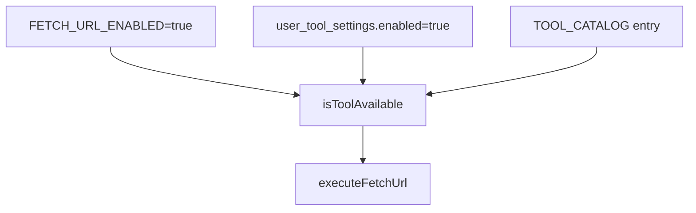

# Plan: tool `fetch_url`

## Contexto

El runtime de tools ya está cableado: catálogo → Zod → handler → `withTracking` → LangGraph. Las tools con `risk: "low"` **no** pasan por confirmación ([`toolRequiresConfirmation`](packages/types/src/catalog.ts) solo aplica a `medium`/`high`).

```mermaid
flowchart LR
  catalog[TOOL_CATALOG]
  zod[TOOL_SCHEMAS]
  handler[executeFetchUrl]
  track[withTracking]
  graph[toolExecutorNode]
  catalog --> zod
  handler --> track --> graph
```

Hoy, el cron sugiere usar `bash` + `curl` para URLs ([`graph.ts` L167-168](packages/agent/src/graph.ts)); con `fetch_url` el agente podrá leer páginas/APIs sin shell.

## Diseño

| Aspecto | Decisión |
|---------|----------|
| **Riesgo** | `low` → ejecución directa vía `withTracking`, sin cambios en [`graph.ts`](packages/agent/src/graph.ts) |
| **Input** | `{ url: string }` — solo `http:` / `https:` |
| **Env gate** | `FETCH_URL_ENABLED=true` obligatorio (fail-closed, como [`bashExec.ts`](packages/agent/src/tools/bashExec.ts) y [`fileTools.ts`](packages/agent/src/tools/fileTools.ts)) |
| **SSRF** | No (según tu elección): solo validar esquema + URL parseable |
| **Límites** | Timeout ~30s (`AbortSignal`), body máx. ~512 KB, redirects máx. 5 |
| **Salida** | JSON estructurado `{ ok, url, final_url?, status, content_type, format, content }` — errores suaves sin lanzar |

### Normalización de contenido

1. Leer `Content-Type` y cuerpo como texto.
2. Si `application/json` (o cuerpo parseable como JSON) → `format: "json"`, `content` como objeto.
3. Si `text/html` → quitar `<script>`/`<style>`, strip de tags, colapsar espacios → `format: "text"`.
4. Resto (`text/plain`, `text/markdown`, etc.) → `format: "text"` tal cual (truncado si supera el límite).

Implementación sin dependencias nuevas (regex + `JSON.parse` con try/catch).

### Respuesta al agente (ejemplos)

```json
{ "ok": true, "url": "https://api.example.com/data", "status": 200, "content_type": "application/json", "format": "json", "content": { "key": "value" } }
```

```json
{ "ok": false, "url": "...", "error": { "code": "TOOL_DISABLED", "message": "Set FETCH_URL_ENABLED=true to enable." } }
```

Códigos de error previstos: `TOOL_DISABLED`, `INVALID_URL`, `HTTP_ERROR`, `TIMEOUT`, `TOO_LARGE`, `FETCH_FAILED`.

## Archivos a tocar

### 1. Catálogo — [`packages/types/src/catalog.ts`](packages/types/src/catalog.ts)

Añadir entrada después de `read_file` (tool de lectura, mismo perfil de riesgo):

- `id` / `name`: `fetch_url`
- `risk`: `"low"`
- `parameters_schema`: `{ url: string }` required
- `description` (inglés, detallada para el modelo): cuándo usar vs `bash`/file tools, proceso, shape del resultado, límites
- `displayName`: `"Fetch URL"`
- `displayDescription`: `"Descarga una URL pública y devuelve texto o JSON limpio."`

### 2. Schema Zod — [`packages/agent/src/tools/schemas.ts`](packages/agent/src/tools/schemas.ts)

```typescript
fetch_url: z.object({
  url: z.string().url().describe("Public HTTP or HTTPS URL to fetch."),
}),
```

### 3. Módulo de ejecución — **nuevo** [`packages/agent/src/tools/fetchUrl.ts`](packages/agent/src/tools/fetchUrl.ts)

Responsabilidades:

- Comprobar `FETCH_URL_ENABLED === "true"`.
- Validar URL (`new URL()`, protocolo `http:`/`https:`).
- `fetch()` nativo de Node con `redirect: "follow"`, `User-Agent` fijo, timeout y lectura con tope de bytes.
- Helpers locales: `stripHtml()`, `tryParseJson()`, `truncate()`.
- Exportar `executeFetchUrl(input): Promise<FetchUrlResult>` siguiendo el patrón `{ ok: true/false }` de [`fileTools.ts`](packages/agent/src/tools/fileTools.ts).

### 4. Wiring — [`packages/agent/src/tools/adapters.ts`](packages/agent/src/tools/adapters.ts)

```typescript
import { executeFetchUrl } from "./fetchUrl";

// en TOOL_HANDLERS:
fetch_url: async (input: { url: string }) => {
  const result = await executeFetchUrl(input);
  return result as unknown as Record<string, unknown>;
},
```

No hace falta tocar [`withTracking.ts`](packages/agent/src/tools/withTracking.ts) ni [`graph.ts`](packages/agent/src/graph.ts).

### 5. Onboarding — [`apps/web/src/app/onboarding/wizard.tsx`](apps/web/src/app/onboarding/wizard.tsx)

Añadir `"fetch_url"` al array `TOOL_IDS` (junto a `read_file`). Settings ya itera `TOOL_CATALOG` completo, así que aparecerá automáticamente en ajustes.

### 6. Documentación de env — [`apps/web/.env.example`](apps/web/.env.example)

```bash
# Fetch URL tool (optional, low-risk)
# Set FETCH_URL_ENABLED=true to allow the agent to HTTP-fetch public URLs from Node.
FETCH_URL_ENABLED=
```

### 7. (Opcional, 1 línea) Cron hint — [`packages/agent/src/graph.ts`](packages/agent/src/graph.ts)

Actualizar el texto de `unattendedContext` para mencionar `fetch_url` además de `bash curl`, ya que es el camino preferido para leer URLs en tareas programadas.

## Flujo de activación



## Test plan manual

1. Añadir `FETCH_URL_ENABLED=true` en [`apps/web/.env.local`](apps/web/.env.local) y reiniciar dev server.
2. Habilitar `fetch_url` en Settings (o re-onboarding).
3. Probar en chat:
   - JSON: `https://httpbin.org/json` → `format: "json"`.
   - HTML: una página pública → `format: "text"` sin tags.
   - Error: URL `ftp://...` → `INVALID_URL`.
   - Error: sin env → `TOOL_DISABLED`.
4. Verificar que **no** aparece confirmación HITL (riesgo low).
5. `npm run type-check` en `packages/agent`.

## Fuera de alcance

- Protección SSRF / blocklist de IPs privadas.
- Tests automatizados (no solicitados).
- Soporte POST, headers custom, o auth.
