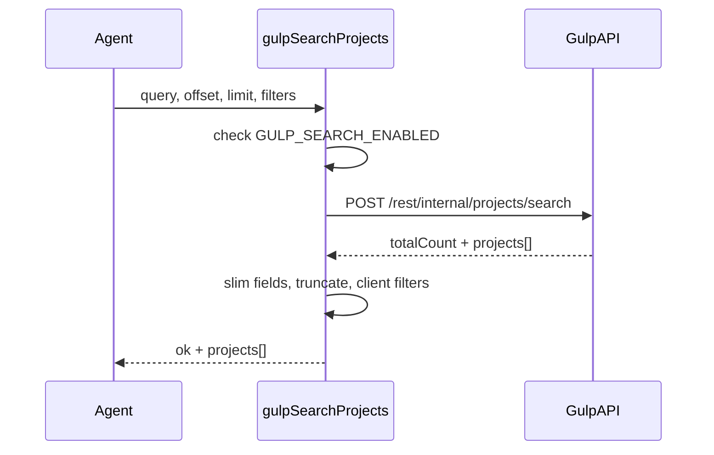

# Plan: tool `gulp_search_projects`

## Problema que resuelve

La página [gulp.de/projekte](https://www.gulp.de/gulp2/g/projekte) es una SPA Angular: `fetch_url` (GET) solo devuelve el mensaje de `<noscript>`. La API interna sí devuelve JSON sin JavaScript:

- **Endpoint:** `POST https://www.gulp.de/gulp2/rest/internal/projects/search`
- **Auth:** no requerida (probado en vivo)
- **Paginación:** `offset` + `limit` (respeta el tamaño; p. ej. `limit: 5` → 5 proyectos)
- **Búsqueda:** `query` reduce `totalCount` (p. ej. `query: "SAP"` → 110 resultados; `query: "Kubernetes"` → 31)

Parámetros probados que **no** filtran en servidor (ignorados): `location`, `isRemoteWorkPossible`, `page`/`size`. Esos filtros irán **client-side** sobre los resultados devueltos.

## Diseño

| Aspecto | Decisión |
|---------|----------|
| **Riesgo** | `low` → sin HITL (como [`fetch_url`](packages/types/src/catalog.ts)) |
| **Env gate** | `GULP_SEARCH_ENABLED=true` (fail-closed, patrón [`fetchUrl.ts`](packages/agent/src/tools/fetchUrl.ts)) |
| **Input** | `query?`, `offset?`, `limit?`, `location?`, `remote_only?` |
| **Límites** | `limit` default 10, max 20; timeout 30s; descripción truncada a ~500 chars |
| **Salida** | `{ ok, total_count, returned, offset, limit, projects[] }` con campos slim |

### Parámetros de la tool

```typescript
{
  query?: string;       // → body.query en la API
  offset?: number;      // default 0
  limit?: number;       // default 10, max 20
  location?: string;    // filtro client-side (substring en project.location, case-insensitive)
  remote_only?: boolean; // filtro client-side (isRemoteWorkPossible === true o location contiene "remote")
}
```

Documentar en la `description` del catálogo que `location`/`remote_only` filtran **sobre la página devuelta**; si el usuario necesita exhaustividad, el agente debe paginar con `offset`.

### Respuesta normalizada (por proyecto)

Campos útiles para el agente, omitiendo `favorite`, `hidden`, `memoText`, etc.:

```typescript
{
  id: string;
  title: string;
  location: string;
  description: string;      // truncada
  url: string;
  start_date: string | null;
  type: string;             // AGENCY | TALENT_FINDER | ...
  is_remote_possible: boolean;
  skills: string[];         // primer skill o resumen truncado
  published_at: string | null;
}
```

### Ejemplo de éxito

```json
{
  "ok": true,
  "tool": "gulp_search_projects",
  "total_count": 110,
  "returned": 5,
  "offset": 0,
  "limit": 5,
  "query": "SAP",
  "projects": [
    {
      "id": "C01293039",
      "title": "Functional Consultant SAP S/4HANA...",
      "location": "Hanau",
      "url": "https://www.gulp.de/gulp2/g/projekte/agentur/C01293039",
      "is_remote_possible": true
    }
  ]
}
```

Códigos de error: `TOOL_DISABLED`, `HTTP_ERROR`, `TIMEOUT`, `FETCH_FAILED`, `INVALID_RESPONSE`.

## Flujo



## Archivos a tocar

### 1. Catálogo — [`packages/types/src/catalog.ts`](packages/types/src/catalog.ts)

Nueva entrada después de `fetch_url`:

- `id` / `name`: `gulp_search_projects`
- `risk`: `"low"`
- `description` (inglés): cuándo usar (buscar freelance/IT projects en Gulp.de), parámetros, que la web SPA no sirve pero esta API sí, shape del resultado, límites
- `displayName`: `"Gulp: buscar proyectos"`
- `displayDescription`: `"Busca proyectos freelance en gulp.de vía su API interna."`
- `parameters_schema` con los 5 campos opcionales

### 2. Schema Zod — [`packages/agent/src/tools/schemas.ts`](packages/agent/src/tools/schemas.ts)

```typescript
gulp_search_projects: z.object({
  query: z.string().min(1).optional().describe("Free-text search sent to Gulp API (e.g. 'SAP', 'Kubernetes')."),
  offset: z.number().int().min(0).optional().default(0),
  limit: z.number().int().min(1).max(20).optional().default(10),
  location: z.string().min(1).optional().describe("Client-side filter: substring match on project location."),
  remote_only: z.boolean().optional().describe("Client-side filter: only remote-friendly projects."),
}),
```

### 3. Módulo nuevo — [`packages/agent/src/tools/gulpSearchProjects.ts`](packages/agent/src/tools/gulpSearchProjects.ts)

Responsabilidades:

- Constantes: `GULP_SEARCH_URL`, `TIMEOUT_MS = 30_000`, `MAX_DESC = 500`
- `executeGulpSearchProjects(input)` → `{ ok: true/false }` sin lanzar
- Construir body API: `{ offset, limit, ...(query ? { query } : {}) }`
- `fetch()` POST con `Accept`/`Content-Type: application/json`, `User-Agent: 10x-builders-agent/1.0`
- Validar respuesta: `totalCount` number + `projects` array
- `slimProject(raw)` — mapear campos API → shape normalizado, truncar `description`
- Filtros client-side post-fetch:
  - `location`: `project.location.toLowerCase().includes(location.toLowerCase())`
  - `remote_only`: `isRemoteWorkPossible === true || /remote/i.test(location)`
- Reutilizar patrón de errores de [`fetchUrl.ts`](packages/agent/src/tools/fetchUrl.ts) (failure helper, AbortController timeout)

**Nota:** si tras filtros client-side `returned < limit` pero `total_count` es mayor, incluir en la respuesta un hint: `"note": "Client-side filters applied; paginate with offset for more API results."` — ayuda al agente sin lógica de re-fetch automático.

### 4. Wiring — [`packages/agent/src/tools/adapters.ts`](packages/agent/src/tools/adapters.ts)

```typescript
import { executeGulpSearchProjects } from "./gulpSearchProjects";

gulp_search_projects: async (input) => {
  const result = await executeGulpSearchProjects(input);
  return result as unknown as Record<string, unknown>;
},
```

No requiere cambios en [`graph.ts`](packages/agent/src/graph.ts) (riesgo low).

### 5. Onboarding — [`apps/web/src/app/onboarding/wizard.tsx`](apps/web/src/app/onboarding/wizard.tsx)

Añadir `"gulp_search_projects"` a `TOOL_IDS` (junto a `fetch_url`). Settings ya itera `TOOL_CATALOG` completo.

### 6. Env — [`apps/web/.env.example`](apps/web/.env.example)

```bash
# Gulp project search tool (optional, low-risk)
# Set GULP_SEARCH_ENABLED=true to allow searching gulp.de projects via internal API.
GULP_SEARCH_ENABLED=
```

## Fuera de alcance (v1)

- Detalle de un proyecto individual (endpoint GET probado → 404)
- Filtros server-side de location/remote (API los ignora)
- Autenticación / favoritos / aplicar a proyectos
- Tool genérica POST en `fetch_url`
- Tests automatizados

## Test plan manual

1. `GULP_SEARCH_ENABLED=true` en `.env.local` + reiniciar dev server.
2. Habilitar `gulp_search_projects` en Settings.
3. Chat: *"Busca proyectos SAP en Gulp"* → debe llamar la tool con `query: "SAP"`.
4. Verificar respuesta con `total_count`, `projects[].url` clicables.
5. Probar `remote_only: true` + `query: "Kubernetes"` → subset filtrado client-side.
6. Probar sin env → `TOOL_DISABLED`.
7. Confirmar que **no** aparece confirmación HITL.
8. `npm run type-check` en `packages/agent`.
